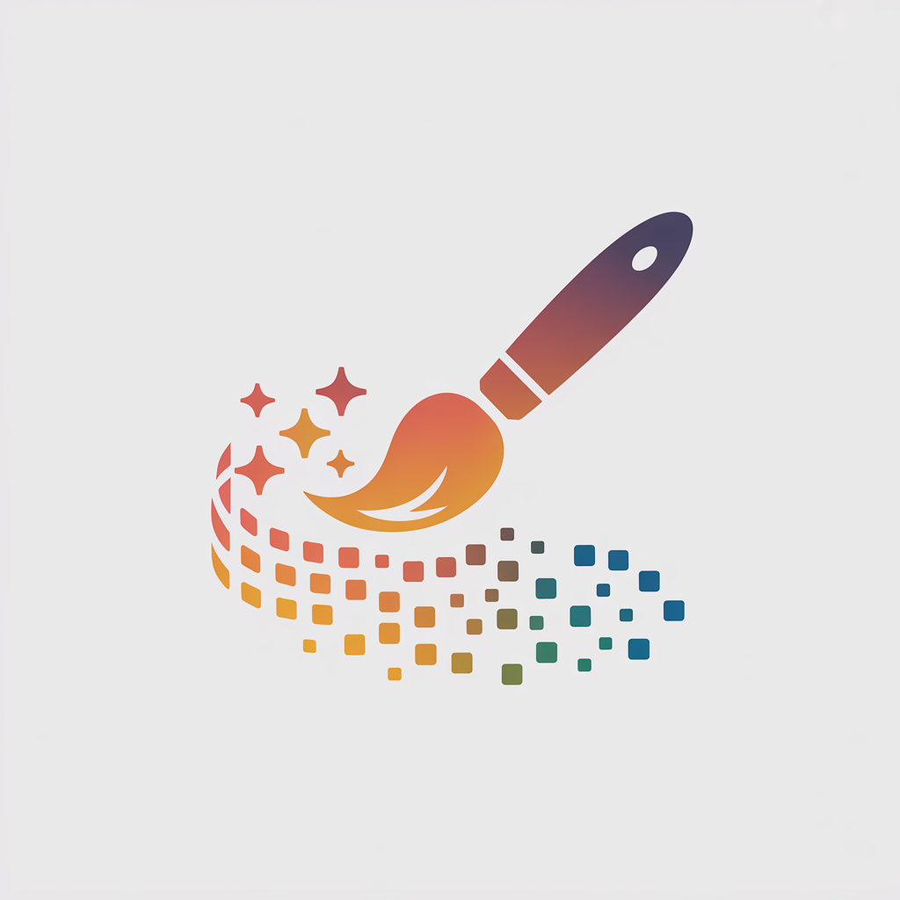

<p align="center">
  
</p>

<h1 align="center">Image Gen</h1>

<p align="center">
  AI-powered image generation CLI and Claude Code skill with multi-provider support.
</p>

<p align="center">
  <a href="https://shipdeckai.github.io/image-gen">Website</a> ·
  <a href="https://github.com/shipdeckai/claude-skills">Get the Plugin</a>
</p>

---

## Plugin Moved

**The Image Gen plugin code has moved to [shipdeckai/claude-skills](https://github.com/shipdeckai/claude-skills).**

This repository now hosts only the [landing page](https://shipdeckai.github.io/image-gen).

## Installation

### For Claude Code Users

1. Add the marketplace (run inside Claude Code):
   ```
   /plugin marketplace add shipdeckai/claude-skills
   ```

2. Install the image-gen plugin:
   ```
   /plugin install image-gen@shipdeckai/claude-skills
   ```

3. Configure at least one API key in your shell profile:
   ```bash
   export OPENAI_API_KEY="sk-..."       # For DALL-E
   export BFL_API_KEY="..."             # For FLUX (best quality)
   export STABILITY_API_KEY="..."       # For Stable Diffusion
   ```

4. Use in any Claude Code session:
   ```
   > Generate a professional product photo of a coffee mug
   ```

## Showcase

<p align="center">
  <a href="https://github.com/shipdeckai/image-gen/releases/download/showcase-v1/hero-image.webp">
    
  </a>
</p>

<p align="center">
  <a href="https://github.com/shipdeckai/image-gen/releases/download/showcase-v1/artistic-render.webp">
    
  </a>
  <a href="https://github.com/shipdeckai/image-gen/releases/download/showcase-v1/icon-logo.webp">
    
  </a>
  <a href="https://github.com/shipdeckai/image-gen/releases/download/showcase-v1/product-mockup.webp">
    
  </a>
</p>

## Supported Providers

| Provider | Best For |
|----------|----------|
| **OpenAI** (DALL-E) | General purpose, text rendering |
| **BFL** (FLUX.2) | Photorealism, product shots |
| **Stability AI** | Controlled generation |
| **Ideogram** | Typography, logos |
| **Gemini** (Imagen) | Multi-image composition |
| **FAL** | Fast iterations |
| **Replicate** | Open models |

## License

MIT
